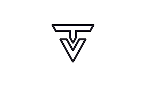

# Project Name: TaskVault  

# Objective :  
Application for managing user's task

## Video / Gif:
- Will Update Soon :smiley:

## Key Features:
1. User Authentication & Authorization: Secure authentication using JWT/Keycloak.
2. Task Management: Create, update, delete, and retrieve tasks.
3. Event Handling: Manage events related to tasks.
4. Notifications: Real-time notifications using Redis Pub/Sub.
5. Scalable Architecture: Microservices architecture ensuring scalability and maintainability.

## How to Use:
Clone Repository : git clone https://github.com/mEEt126/TaskVault.git
 
## Frameworks/Technologies Used:
1. Node.js
2. Express.js
3. Postgres 
4. Sequelize
5. Keycloak 
6. RabbitMQ
7. POSTMAN
8. Docker
9. Git

## Resources:

## Contact Info:
- Name: Meet Gandhi
- Email: gandhimeet1389@gmail.com
- Contact: 9427732664
